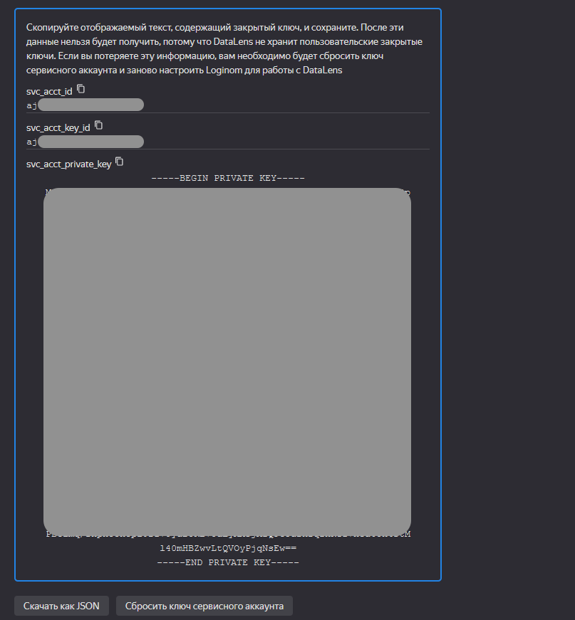
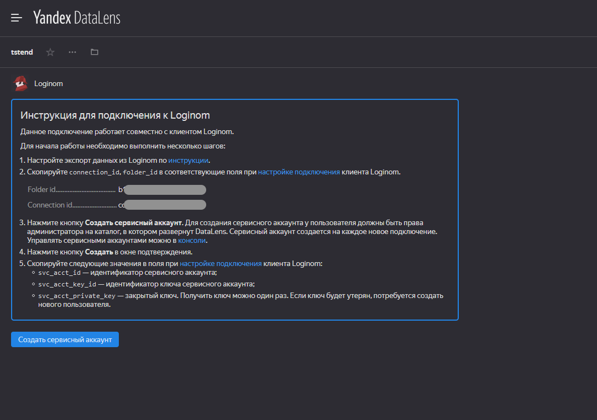
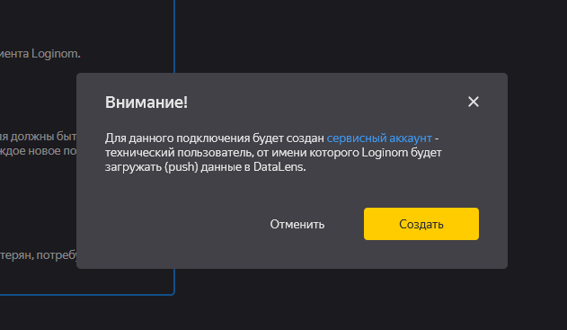
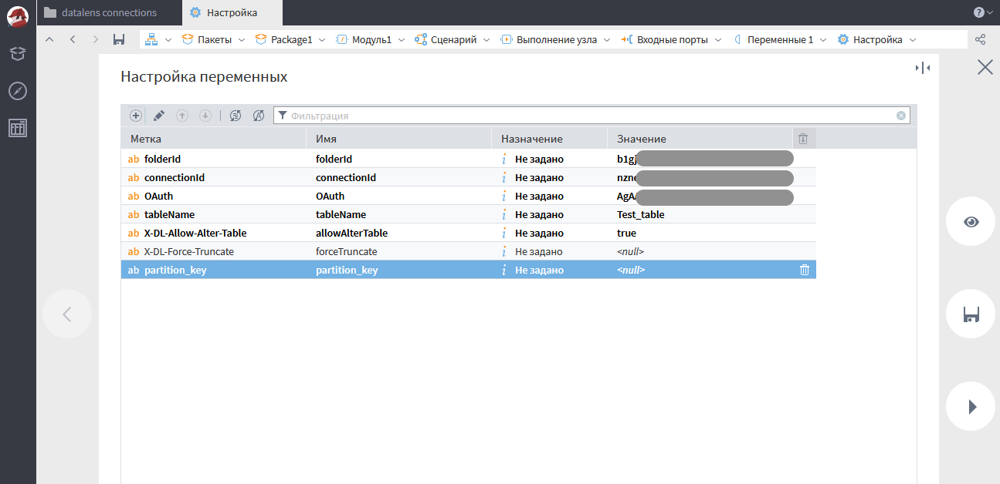

# Экспорт данных из Loginom в Yandex.DataLens

## Подключение коннектора к сценарию

Для начала работы необходимо скачать библиотеку, содержащую узел «Экспорт в DalaLens». Сделать это можно на [github.com/loginom/loginom-datalens-connector](https://github.com/loginom/loginom-datalens-connector). Чтобы использовать компонент, необходимо подключить загруженную библиотеку к нужному сценарию.

Перейдём в Loginom. Для работы с коннектором подойдёт любая редакция Loginom, как [бесплатная настольная версия Community Edition](https://loginom.ru/download), так и любая серверная редакция. В серверных редакциях перед использованием нужно будет загрузить полученный файл пакета, а также файл, требуемый для хранения clientId, в файловое хранилище Loginom.

Для дальнейшего использования компонента необходимо перейти в раздел Ссылки и добавить ссылку на загруженный ранее пакет DataLens.

Подключение используется с помощью компонента «Выполнение узла». Переносим его на сценарий и в мастере настройки выбрать подмодель DataLens из пакета DataLens.

После настройки у узла появятся два входных порта и один выходной. На вход необходимо передать таблицу с набором данных, которые нужно отправить в DataLens. Порт переменных можно настроить вручную (см. рисунок ниже) или передав значение переменных из другого узла.

## Настройка подключения на стороне DataLens

Параметры для настройки подключения нужно получить в интерфейсе DataLens. Для этого [в Маркетплейсе DataLens](https://datalens.yandex.ru/marketplace) выбираем коннектор Loginom, затем нажимаем «Подключить». После чего мы сможем создавать новые подключния к Loginom. Это можно сделать несколькими способами:

— в основной области консоли DataLens нажать на кнопку «Создать соединение»

— в любом каталоге DataLens выбрать «Создать» → «Подключение»

После этого откроется страница с параметрами соединения.

А после запроса OAuth-токена заполнится соответсвующее поле.

## Установка параметров подключения

Далее остается заполнить полученные параметры в значения соответствующих переменных.

Параметры полученные из DataLens:
 * folderId — id папки в которой расположено подключение;
 * connectionId — id самого подключения Loginom в DataLens;
 * OAuth — токен полученный в подключении DataLens.

Параметры задаваемые пользователем:

 * tableName — название таблицы в подключении;
 * allowAlterTable — разрешает изменение схемы таблицы на указанную в запросе, если схема на DataLens отличается, то она будет перезаписана на ту что отправляется в запросе (при перезаписи схемы старая таблица удаляется);
 * force-Truncate — перед записью данных в таблицу удаляется старая;
 * partition_key — перечисление ключей партицирования через запятую.

> **ВАЖНО:** Файл `./data/client_id.e.lgd` нужен для корректной работы пакета, в нем хранятся "clientId" подключения. При переносе пакета на новое место файл с "clientId" должен переноситься вместе с пакетом.
