# Создание подключения в Datalens

Добавить подключение к аккаунту [Yandex DataLens](https://datalens.yandex.ru) можно [по ссылке](https://cloud.yandex.ru/marketplace/products/f2ei0qadag16ma9fr1re) или в [разделе коннекторов Datalens Маркетплейса Яндекс.Облака](https://cloud.yandex.ru/marketplace?type=datalens&categories=connector). Нажимаем на кнопку "Открыть в Datalens",

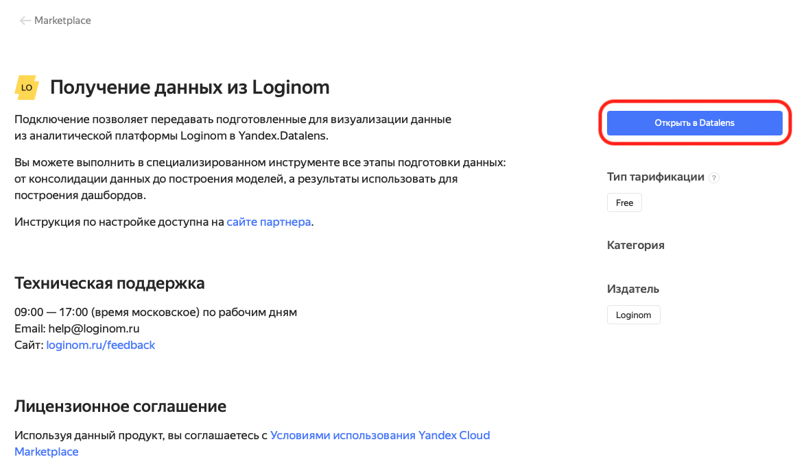

а после перехода выбираем "Развернуть".

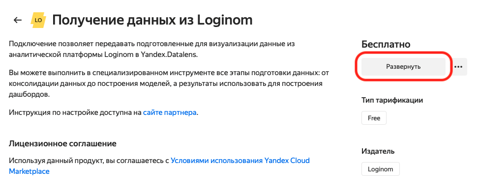

Задаем имя для нового подключения и уровень доступности (для конкретного пользователя или для компании).

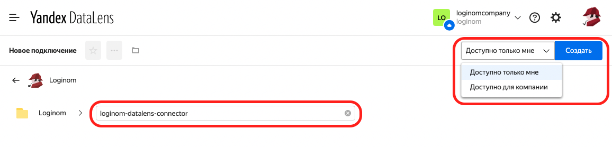

После этого откроется страница со ссылкой на инструкцию, основными шагами и кнопкой создания сервисного аккаунта.
> **ВНИМАНИЕ:** Для создания аккаунта пользователь должен иметь на это права.

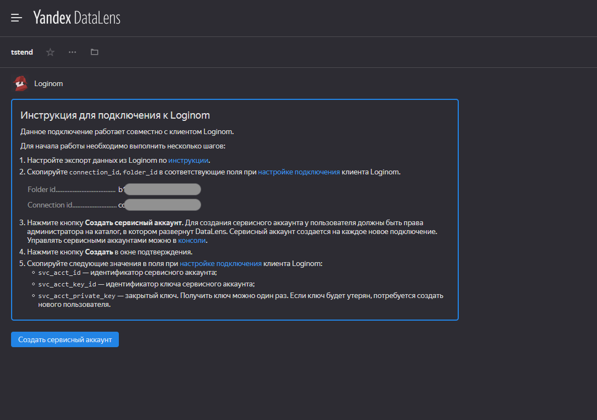

Нажмите кнопку "Создать" в окне подтверждения.

После запроса на создание сервисного аккаунта, будет сгенерирован ключ сервисного аккаунта, который нужно скачать в виде JSON-файла (кнопка "Скачать как JSON").

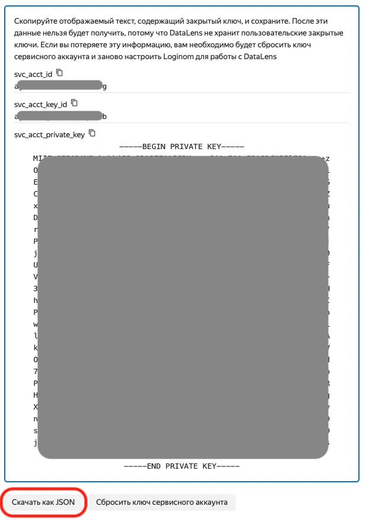

# Настройка на стороне Loginom

Далее работа будет вестись в клиенте Loginom.  
В файловое хранилище Loginom копируем файл пакета, содержащего библиотеку [Loginom Datalens Connector](https://github.com/loginom/loginom-datalens-connector) (файл DataLens.lgp), а также полученный ранее JSON-файл.

Для использования подключения в пакете нужно в настройках ссылок пакета добавить ссылку на пакет DataLens

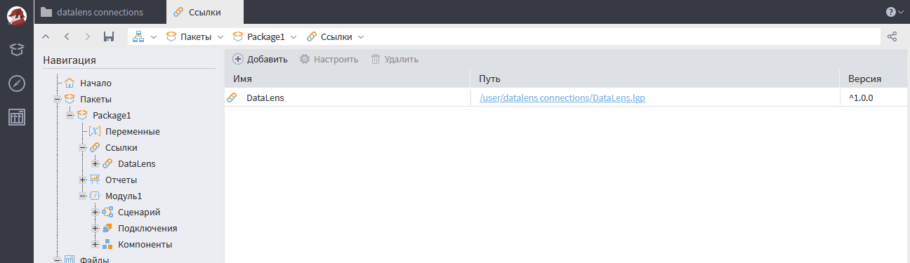

## Получение clienID

Для начала работы с новым подключением необходимо получить уникальный идентификатор, нужный для работы с этим подключением – *clientID*. Сделать это можно при помощи компонента, поставляемого с библиотекой Loginom Datalens Connector.

Добавим новый узел "Выполнение узла",

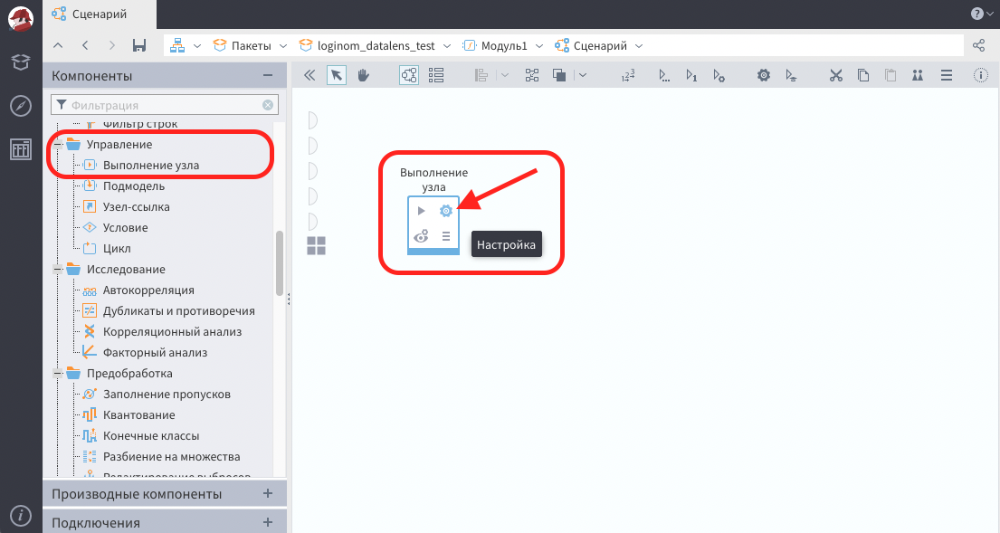

а в его настройках выберем "Получение clientID".

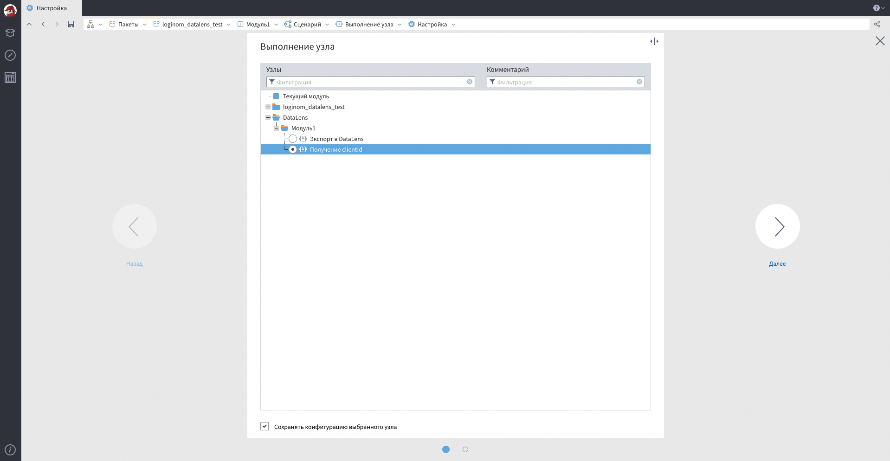

Узел "Выполнение узла" изменит внешний вид, а нам нужно будет перейти к настройке входных переменных узла. Для удобства можно изменить название узла.

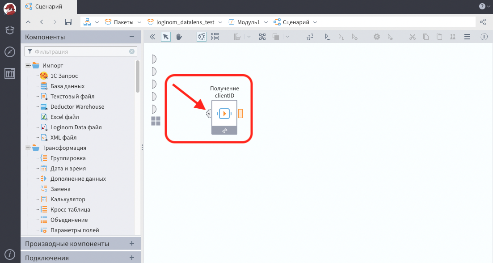

Далее откроем настройку входного порта переменных узла. Для начального получения *clientID* достаточно задать значение переменной *pathConnData* и выполнить узел.

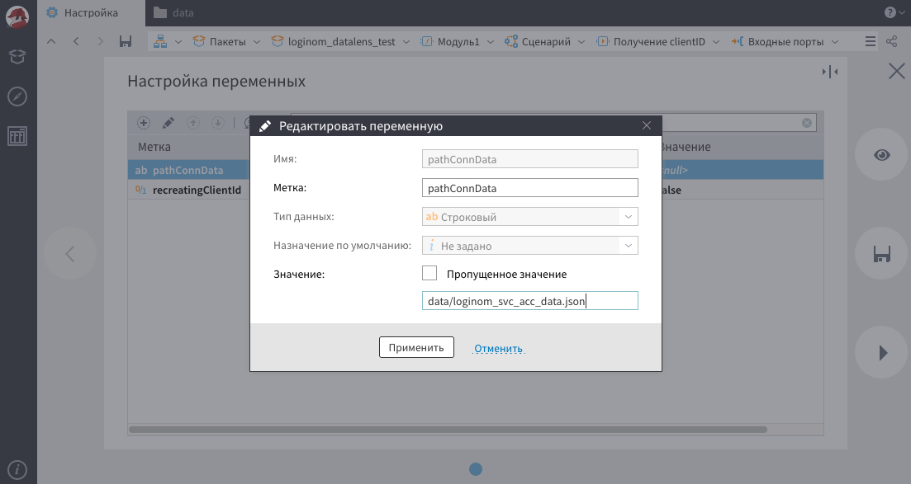  

Если возникнет всплывающее окно с предложением удалить все потерянные связи, нужно ответить "Да".

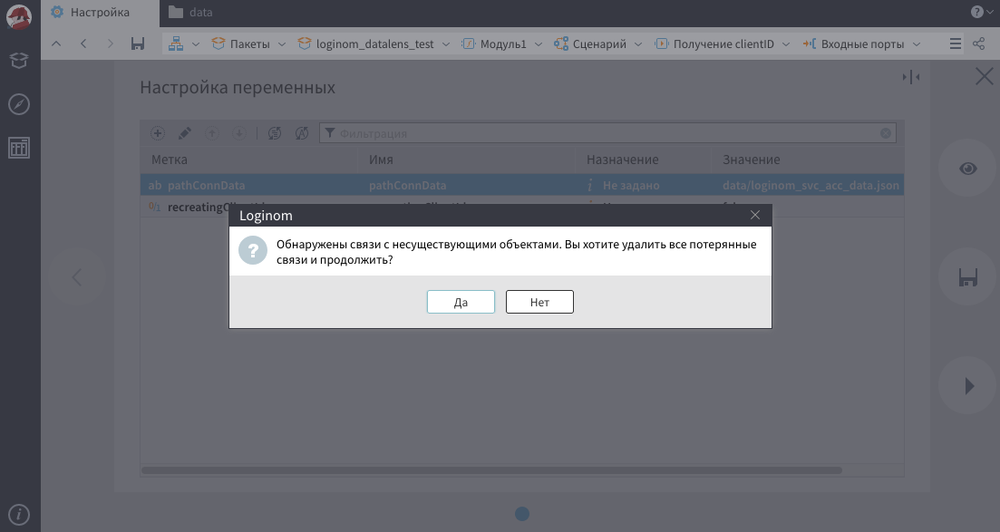

Параметры для получения client_id:

 * *pathConnData* — Относительный путь в файловом хранилище Loginom от пакета в котором используется "Выполнение узла" до JSON-файла полученного ранее. Обязателен к заполнению.
 * *recreatingClientId* — потребуется, если нужно пересоздать *clientID*. При перезапуске узла со значением этого параметра *true*, будет пересоздано соединение к подключению и получен новый *clientId*. Работает аналогично функции "сброс пароля". Обязателен к заполнению, по умолчанию *false*.

> **ВНИМАНИЕ:** При использовании узла со значением переменной *recreatingClientId* = *true*, будет пересоздан параметр *clientID* и все сценарии, в которых использовалось старое значение *clientID* перестанут работать.

После выполнения узла откроем быстрый просмотр выходных значений 

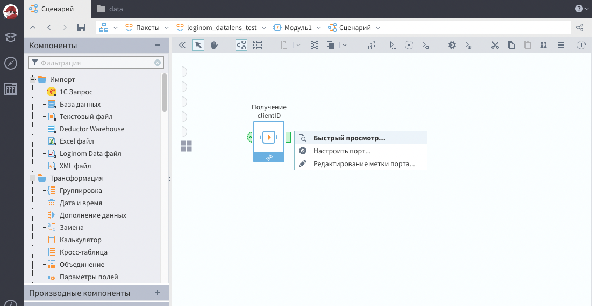  

и сохраним полученное значение *clientID*. Если одно подключение Datalens будет использоваться в нескольких сценариях, то нужно указать этот параметр во всех узлах экспорта данных в Datalens.

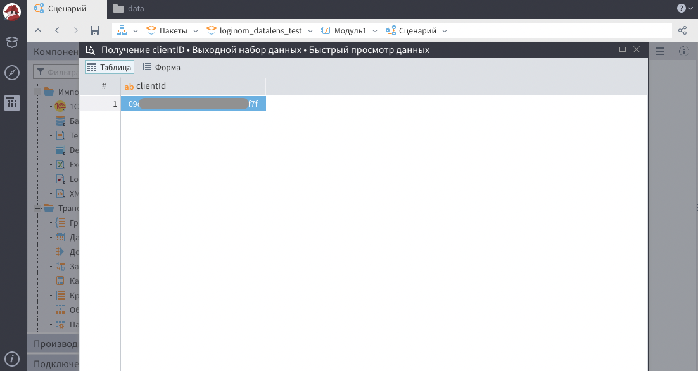  

## Экспорт данных в Datalens

Если уже получен *clientId*, то можно приступить к экспорту в DataLens. Создаем узел "Выполнение узла" и выбираем в настройках вариант "Экспорт в Datalens".

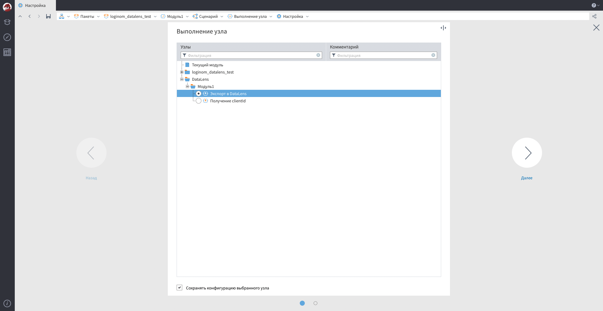

Узел "Выполнение узла" изменит внешний вид, а нам нужно будет перейти к настройке входных переменных узла. Для удобства можно переименовать название узла. Подключаем на входной табличный порт экспортируемые данные 

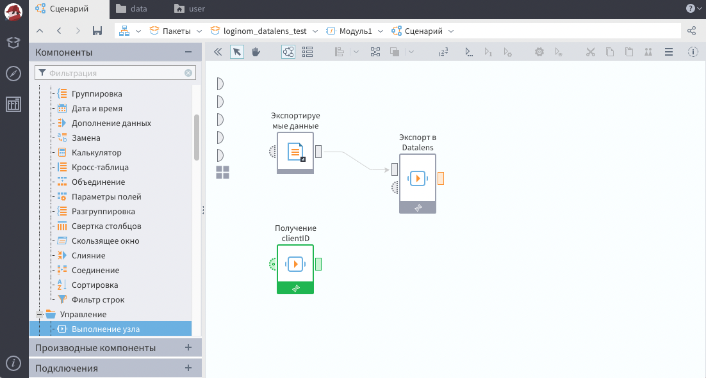

и заходим в настройку входного порта переменных для задания параметров экспорта.

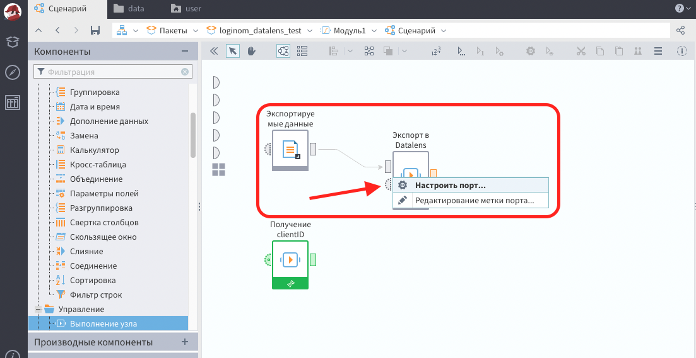

Настраиваем необходимые параметры, в том числе указываем путь в JSON-файлу и *clientID*, полученные нами ранее.

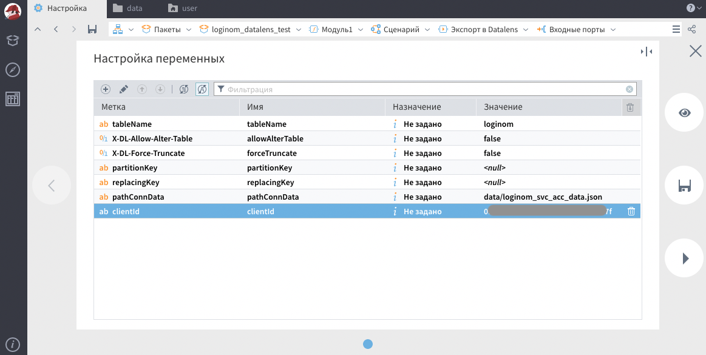

Параметры экспорта в DataLens:

 * *tableName* — Название таблицы в подключении. Обязателен к заполнению.
 * *allowAlterTable* — Разрешает изменение схемы таблицы на указанную в запросе, если схема на DataLens отличается, то она будет перезаписана на ту что отправляется в запросе (при перезаписи схемы старая таблица удаляется). Не обязателен к заполнению, по умолчанию *false*.
 * *forceTruncate* — Перед записью данных в таблицу удаляется старая. Не обязателен к заполнению, по умолчанию *false*.
 * *partitionKey* — Перечисление ключей партицирования через запятую (если ключ не указан, то в его качестве выбирается первый столбец с типом данных *`string`*, *`integer`* или *`datetime`*). Не обязателен к заполнению, по умолчанию *null*.
 * *replacingKey* — Перечисление ключей замены через запятую. Не обязателен к заполнению, по умолчанию *null*.
 * *pathConnData* — Путь к файлу JSON как и у получения *clientId*. Обязателен к заполнению.
 * *clientId* — Полученный ранее *client_id*. Обязателен к заполнению.

## Выполнение и просмотр результатов

Далее можно выполнить узел "Экспорт в Datalens" 

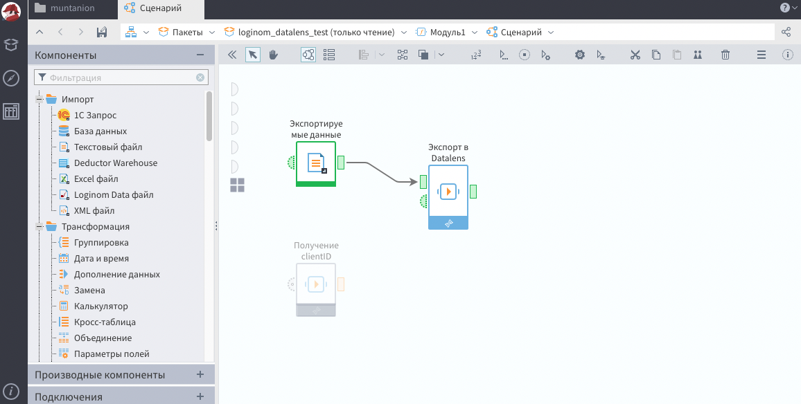

и посмотреть полученные данные в подключении на стороне Datalens.

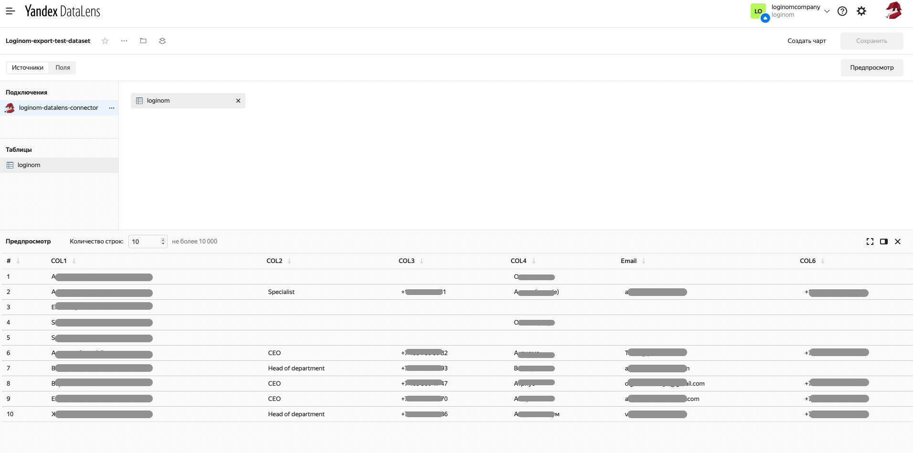