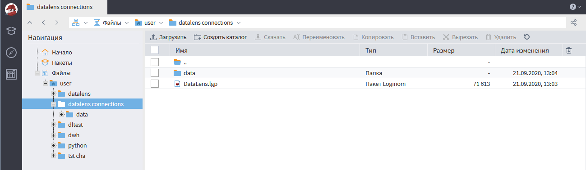
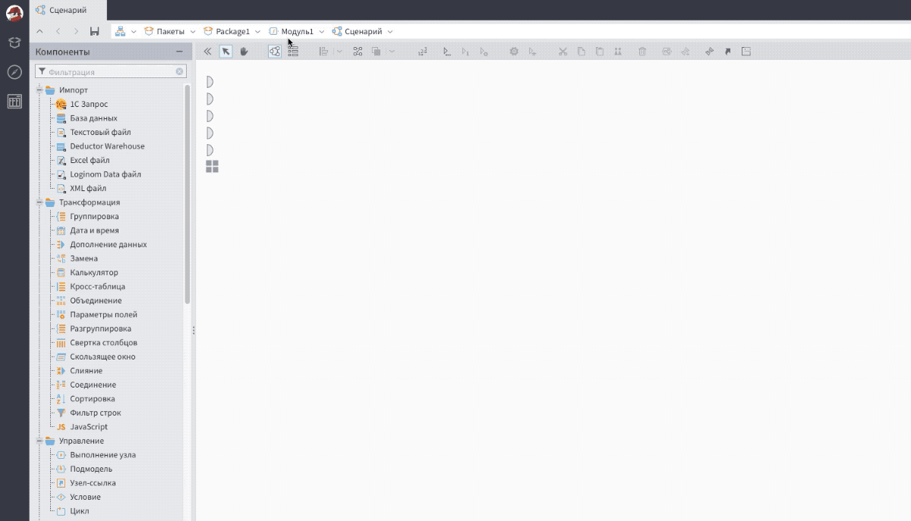
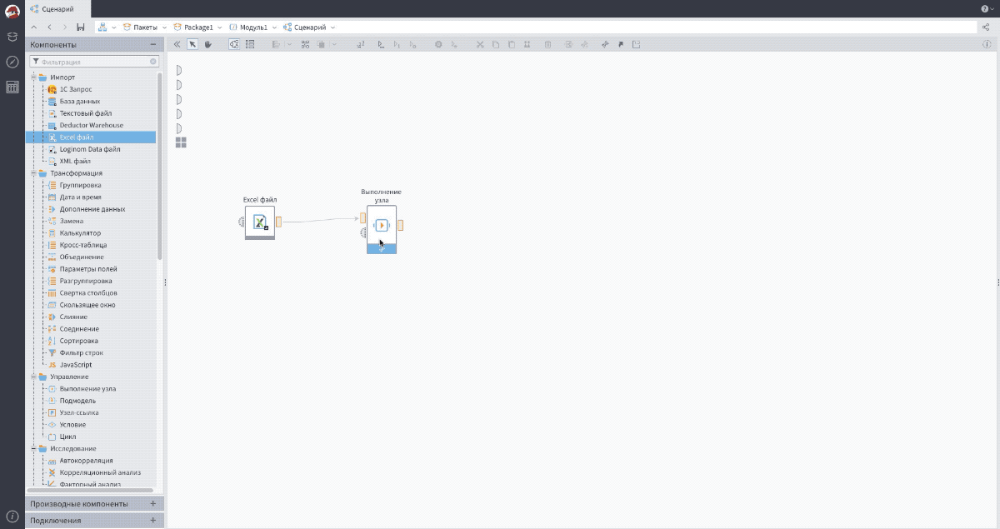
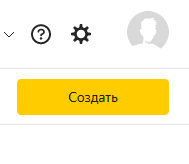
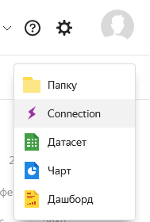

# Экспорт данных из Loginom в Yandex.DataLens

## Подключение коннектора к сценарию

Для начала работы необходимо скачать библиотеку, содержащую узел «Экспорт в DalaLens». Сделать это можно на [github.com/loginom/loginom-datalens-connector](https://github.com/loginom/loginom-datalens-connector). Чтобы использовать компонент, необходимо подключить загруженную библиотеку к нужному сценарию.

Перейдём в Loginom. Для работы с коннектором подойдёт любая редакция Loginom, как [бесплатная настольная версия Community Edition](https://loginom.ru/download), так и любая серверная редакция. В серверных редакциях перед использованием нужно будет загрузить полученный файл пакета, а также файл, требуемый для хранения clientId, в файловое хранилище Loginom.

Для дальнейшего использования компонента необходимо перейти в раздел Ссылки и добавить ссылку на загруженный ранее пакет DataLens.

Подключение используется с помощью компонента «Выполнение узла». Переносим его на сценарий и в мастере настройки выбрать подмодель DataLens из пакета DataLens.

После настройки у узла появятся два входных порта и один выходной. На вход необходимо передать таблицу с набором данных, которые нужно отправить в DataLens. Порт переменных можно настроить вручную (см. рисунок ниже) или передав значение переменных из другого узла.

## Настройка подключения на стороне DataLens

Параметры для настройки подключения нужно получить в интерфейсе DataLens. Для этого [в Маркетплейсе DataLens](https://datalens.yandex.ru/marketplace) выбираем коннектор Loginom, затем нажимаем «Подключить». После чего мы сможем создавать новые подключния к Loginom. Это можно сделать несколькими способами:

— в основной области консоли DataLens нажать на кнопку «Создать соединение»

— в любом каталоге DataLens выбрать «Создать» → «Подключение»

После этого откроется страница с параметрами соединения и кнопкой создания сервисного аккаунта.

> **ОБРАТИТЕ ВНИМАНИЕ:** Для создания аккаунта пользователь должен иметь на это права.

При нажатии на кнопку создания сервисного аккаунта возникнет следующее диалоговое окно.

После запроса на создание сервисного аккаунта заполнятся соответствующие поля

Скачиваем файл с параметрами подключения нажав на кнопку «Скачать как JSON». В дальнейшем потребуется загрузить полученный файл в файловое хранилище Loginom и указать путь к нему в качестве значения переменной **pathConnData**.

## Установка параметров подключения

Дальнейшая работа будет вестись в клиенте Loginom.

В файловое хранилище Loginom копируются полученный файл пакета и данных Loginom.

Для использования подключения в пакете нужно в настройках ссылок пакета добавить ссылку на пакет DataLens.

Затем в сценарии добавить узел "Выполнение узла" и выбрать подмодель DataLens из пакета DataLens.

Последним шагом настройки подключения будет настройка переменных узла.

 

 * tableName — название таблицы в подключении;
 * allowAlterTable — разрешает изменение схемы таблицы на указанную в запросе, если схема на DataLens отличается, то она будет перезаписана на ту что отправляется в запросе (при перезаписи схемы старая таблица удаляется);
 * forceTruncate — перед записью данных в таблицу удаляется старая;
 * partitionKey — перечисление ключей партицирования через запятую (если ключ не указан, то в его качестве выбирается первый столбец с типом данных `string`, `integer` или `datetime`);
 * replacingKey — перечисление ключей замены через запятую;
 * pathConnData — путь к файлу json скачанному после создания сервисного аккаутна относительно пакета в котором используется подключение (пример указания пути `connections/test connection.json`).

> **ВАЖНО:** Файл `./data/clientId.json` нужен для корректной работы пакета, он выполняет роль хранилища идентификаторов установленных подключений.