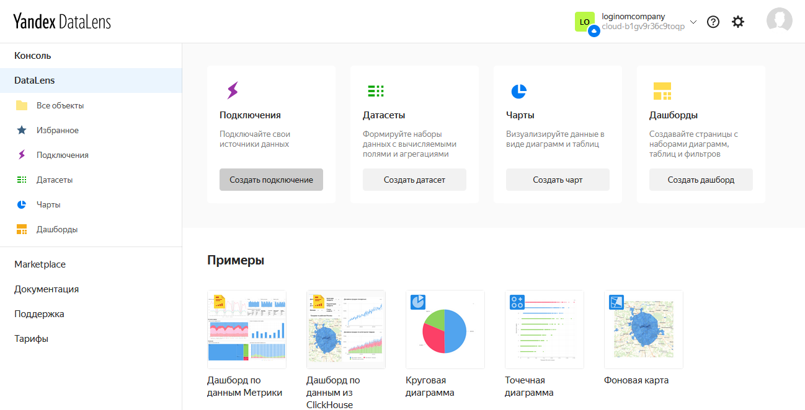
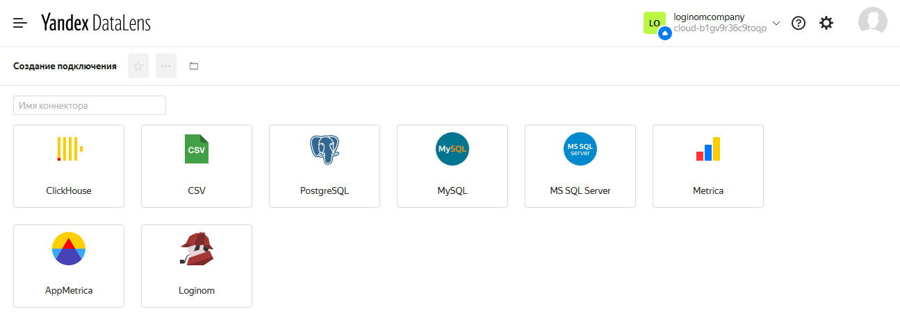
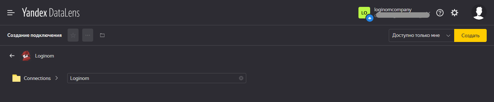
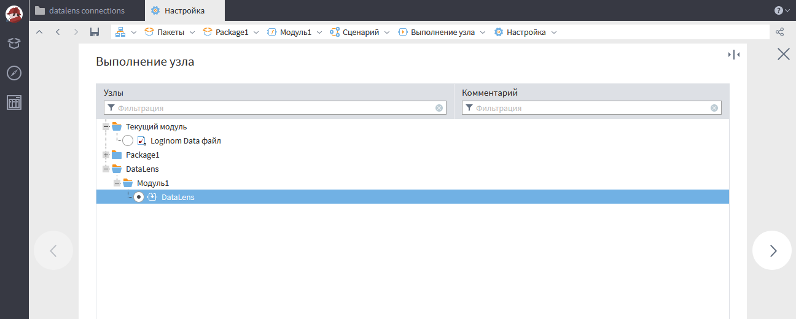
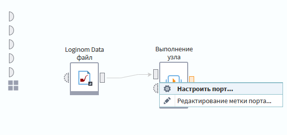

# Создание соединения

Предварительно соединение приобретается в магазине.
Соединение создается в [Yandex DataLens](https://datalens.yandex.ru). Для этого надо в основной области консоли DataLens на кнопку Создать соединение

или в любой папке DataLens выбрать "Создать" → "Подключение"

  

выбрать Loginom и ввести название соединения.

  

После этого откроется страница с параметрами соединения и кнопкой создания сервисного аккаунта.
> **ВНИМАНИЕ:** Для создания аккаунта пользователь должен иметь на это права.

При нажатии на кнопку создания сервисного аккаунта возникнет следующее диалоговое окно.

После запроса на создание сервисного аккаунта заполнится соответсвующее поле

Далее работа будет вестись в клиенте Loginom.  
В файловое хранилище Loginom копируются полученный файл пакета и данных Loginom

Для использования подключения в пакете нужно в настройках ссылок пакета добавить ссылку на пакет DataLens

Затем в сценарии добавить узел "Выполнение узла" и выбрать подмодель из пакета DataLens.  
Для загрузки данных в DataLens следует выбрать одноименную подмодель.  
Подмодель clientId используется для создания соединения к подключению и получения идентификатора установленного соединения.

При первом запуске последующим шагом настройки подключения будет получение client_id.  
Для этого в узле "Выполнение узла" нужно выбрать подмодель "clientId".

Далее зайти у узла в настройку входного порта переменных.

  

Параметры для получения client_id:

 * pathConnData — Относительный путь в файловом хранилище Loginom от пакета в котором используется "Выполнение узла" до JSON-файла полученного ранее. Обязателен к заполнению.
 * recreatingClientId — если уже было получено clientId и ухел был перезапущен со значением этого параметра true, то при выполнении узла будет пересоздано соединение к подключению и получение нового clientId. Обязателен к заполнению, по умолчанию false.

> **ВНИМАНИЕ:** В сценариях в которых используется экспорт в DataLens к этому подключению но со старым clientId перестанет раболтать экспорт в DataLens до изменения clientId на новый

Если уже получен clientId, то можно приступить к экспорту в DataLens.  
Создаем узел "Выполнение узла" по подмодели DataLens

Подключаем на входной табличный порт экспортируемые данные и заходим в настройку входного порта переменных для задания параметров экспорта.

  

Параметры экспорта в DataLens:

 * tableName — Название таблицы в подключении. Обязателен к заполнению.
 * allowAlterTable — Разрешает изменение схемы таблицы на указанную в запросе, если схема на DataLens отличается, то она будет перезаписана на ту что отправляется в запросе (при перезаписи схемы старая таблица удаляется). Не обязателен к заполнению, по умолчанию false.
 * forceTruncate — Перед записью данных в таблицу удаляется старая. Не обязателен к заполнению, по умолчанию false.
 * partitionKey — Перечисление ключей партицирования через запятую (если ключ не указан, то в его качестве выбирается первый столбец с типом данных `string`, `integer` или `datetime`). Не обязателен к заполнению, по умолчанию null.
 * replacingKey — Перечисление ключей замены через запятую. Не обязателен к заполнению, по умолчанию null.
 * pathConnData — Путь к файлу JSON как и у получения clientId. Обязателен к заполнению.
 * clientId — Полученный ранее client_id. Обязателен к заполнению.